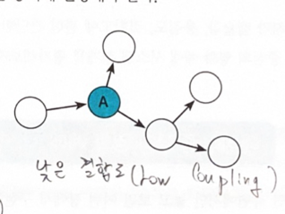

# 설계 품질과 트레이드 오프

책임 주도 설계: 적절한 책임이 중요하다.
객체 지향 설계: 객체에 올바른 책임 할당 + 낮은 결합도와 높은 응집를 가진 구조 설계

결합도와 응집도를 합리적으로 관리하는 원칙 : 객체의 상태가 아니라, 객체의 행동에 초첨을 두는 것.

## 01데이터 중심의 영화 예매 시스템
데이터 중심: 독립된 데이터 덩어리
책임 중심 : 협력하는 공동체의 일원

책임에 초점을 맞춰야 변경에서 자유롭다.
데이터 중심, 상태 중심으로 설계했을 때, 상태 변경이 객체의 인터페이스도 변경시킬 수 있다. -> 인터페이스에 의존하는 모든 객체에 영향을 미칠 수 있다.

### 영화를 예매하자.
Reservation Agency

## 02 설계 트레이드 오프
3가지 품질 척도: 캡슐화, 응집도, 결합도

캡슐화: 변경에서 안정적인 부분만 골라서 보여줌으로써 변경의 여파를 통제할 수 있다.
변경될 가능성이 높은 부분을 `구현`이라 부른다. 안정적인 부분을 `인터페이스`라고 부른다.
복잡성을 다루기 위한 가장 중요한 도구는 `추상화`이다.
변경될 수 있는 어떤 것도 캡슐화 해야 한다.
유지보수성이 목표다. 

응집도:객체 내에 관련된 책임들이 분포된 정도.

결합도: 객체가 협력에 필요한 적절한 수준의 관계만 유지하고 있는지를 나타낸다.

높은 응집도와 낮은 결합도의 사진

인터페이스에 대해 프로그래밍 했을 때 낮은 결합도를 가질 수 있다.

변경 가능성이 낮은 모듈(프레임워크, 표준 라이브러리에 포함된 모듈)등에 결합도가 높은 것은 큰 문제가 되지 않는다.
하지만 직접 작성한 코드는 낮은 결합도를 유지하려고 노력해야 한다.

## 03 데이터 중심의 영화 예매 시스템의 문제점
- 캡슐화 위반
- 높은 결합도
- 낮은 응집도

### 캡슐화 위반
Movie 객체의 경우, getFee()같은 메서드들은 자신의 상태를 고스란히 드러내고 있다.

설계시에 협력을 고려하지 않으면, 캡슐화를 위반하는 과도한 접근자와 생성자를 가지게 된다.
이를 추측에 의한 설계 전략이라고도 한다. 즉 객체가 사용될 협력을 고려하지 않고, 객체가 다양한 상황에서 사용될 것이라는 막연한 추측에 기반해 설계하기 때문이다.

### 결합도 높음
ReservationAgency의 경우 모든 결합의 총체이다.

### 낮은 응집도
관련성이 낮은 코드들이 뭉처있기 때문에, 변경시 관련 없는 코드도 영향을 받게 된다.
가령 할인 정책을 추가하는 작업이 할인 조건에도 영향을 미치게 된다.
여기에서 아무 상관이 없다는 것은 다른 책임이라는 말이다.

## 04 자유로운 객체를 향해
### 캡슐화를 지켜라

### 스스로 자신의 데이터를 책임지는 객체
캡슐화를 통해서 자신의 데이터를 책임지고, 결합도를 낮춤.

## 05 하지만 여전히 부족하다.
### 캡슐화 위반
내부 구현의 변경이 외부로 퍼져나가는 `파급효과`는 캡슐화가 부족하다는 증거다.
캡슐화는 `변경될 수 있는 어떤 것`도 외부에 감추는 것을 의미한다.

### 높은 결합도

### 낮은 응집

## 06 데이터 중심 설계의 문제점
너무 이른 시기에 데이터를 결정해서 문제가 된다. 
